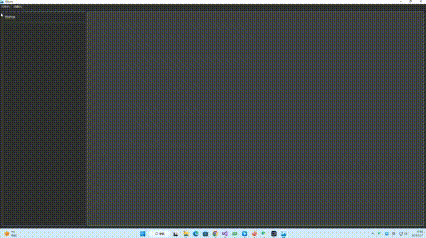

# week17

## 进度

### 3.4

qt model掌握, 事件掌握
1. Qt Model
2. QItemSelectionModel
3. QListWidget
4. QItemDelegate

### 3.5
完成<C++内存常见问题.md>

### 3.6 - 3.8

完成<Qt电子相册>项目, 强化qss, ui文件使用, 修改简历准备投递
[Qt电子相册](https://github.com/Playerfff/Album)

## 下周规划

1. 完成<分布式kv-存储引擎.xmind>
2. 完成<分布式kv-数据一致性.xmind>
3. 找实习

## 问题
无