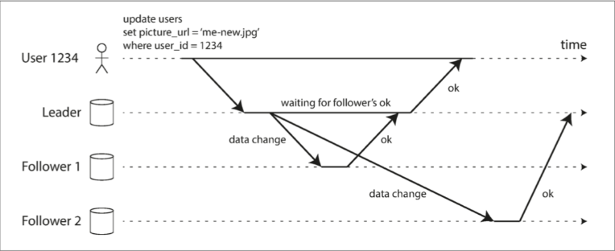
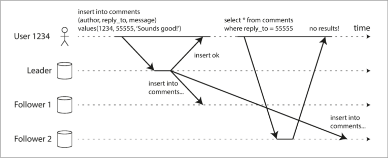
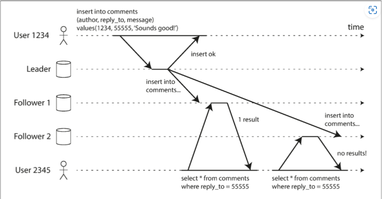
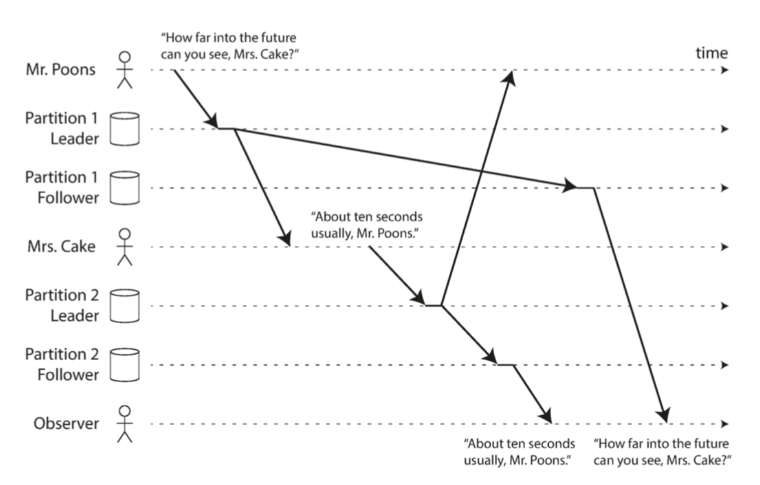
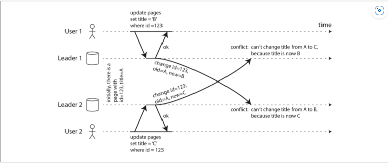
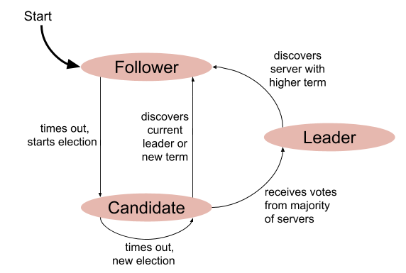

# 数据系统的基石

## 可靠性、可维护性、可拓展性

1. **数据密集型**和**计算密集型**的区别是什么？
   1. 数据密集型应用程序受制于**数据量**、**数据复杂性**、以及**数据的变更速度**；
   2. 计算密集型应用程序受制于**CPU速度**。
2. 有哪些衡量分布式系统好坏的指标？
   1. 可靠性： 系统在**困境（adversity）**（硬件故障、软件故障、人为错误）中仍可正常工作（正确完成功能，并能达到期望的性能水准）。
   2. 可拓展性： 系统在**困境（adversity）**（硬件故障、软件故障、人为错误）中仍可正常工作（正确完成功能，并能达到期望的性能水准）。
   3. 可维护性： 许多不同的人（工程师、运维）在不同的生命周期，都能高效地在系统上工作（使系统保持现有行为，并适应新的应用场景）。
3. 分布式系统有哪些常见的故障?
   1. 软件故障;
   2. 硬件故障;
   3. 人为故障;
4. 有哪些描述性能的指标?
   1. 算术平均数: 隐藏了有多少用户实际上经历了极端情况;
   2. **百分位点**很好的表现了这个情况。
5. 什么是水平扩展和垂直扩展？
   1. horizontal scaling: 将负载分不到多台小机器;
   2. vertical scaling: 转向更强大的机器。
   3. 但是高端机器可能非常昂贵， 所以非常密集的负载通常无法避免地需要横向扩展。
6. 什么是无状态服务和有状态服务？
   1. 无状态服务的服务端不会保存任何关于前一次请求的信息。

## 数据模型与查询语言

1. 什么是关系型数据模型，它的优缺点是什么？
   1. 用表格（关系）来表示和存储数据的数据模型。
   2. 主键： 每个表格通常有一个主键，用于唯一标识表中的每个记录。
   3. 外键： 表格之间可以通过外键建立关系，实现数据的关联性。
   4. 缺点：固定的模式、拓展性不高。
2. 什么是 NoSQL 数据库，它的优缺点是什么？
   1. NoSQL（Not Only SQL）数据库是一类不依赖于传统的关系型数据库模型的数据库系统。这些数据库系统采用了不同的数据模型，包括**文档型**、**键值对型**、**列族型**和**图型**等，以满足不同类型和规模的数据存储需求。NoSQL数据库的出现是为了解决关系型数据库在某些方面的限制。
   2. 优点：
      1. 灵活的数据模型；
      2. 分布式架构；
      3. 无固定模式；
   3. 缺点：
      1. 分布式环境下一致性和事务的处理；
      2. 查询语言不同意。
3. 什么是文档数据库？它和关系型数据库有什么区别？
   1. 文档数据库是一种 NoSQL 数据库，其数据模型基于文档的表示形式，通常使用像 JSON 或 BSON 这样的格式。数据以文档为单位存储，每个文档可以包含不同结构的字段，允许嵌套和非规范化的数据。MongoDB 是一个常见的文档数据库例子。
   2. 特点：
      1. **文档模型：** 数据以文档的形式存储，文档是键值对的集合，可以包含嵌套的文档和数组。

      2. **水平扩展：** 支持水平扩展，能够在多个节点上分布数据。

   3. 文档数据库与关系型数据库的区别：

      1. **数据模型：**
         - 关系型数据库使用**表格**的结构，其中每行是一个记录，每列是一个属性。数据需要预定义表结构。
         - 文档数据库使用**文档**的结构，每个文档是一个自包含的单元，不需要预定义的模式，可以包含不同结构的字段。

      2. **数据一致性和事务：**
         - 关系型数据库通常提供强一致性和事务支持，确保数据的完整性。
         - 文档数据库在一致性和事务方面可能相对较弱，特别是在分布式环境中。

      3. **应用场景：**
         - 关系型数据库适用于需要强调事务处理和数据一致性的应用，如金融系统、订单处理等。
         - 文档数据库适用于半结构化和非结构化数据的场景，如内容管理系统、博客平台、实时协作工具等。

4. 什么是图数据库？它适用于哪些场景？
   1. 图数据库是一种特殊类型的数据库，专门设计用于存储和处理图形数据结构。图数据库的数据模型基于图的概念，其中包含节点（表示实体）和边（表示节点之间的关系）。图数据库通过这些节点和边的连接关系来表示复杂的关联性数据。
   2. 图数据库的特点：

      1. **节点：** 表示实体的基本单元，可以包含属性描述实体的特征。

      2. **边：** 表示节点之间的关系，可以包含属性描述关系的特征。

      3. **灵活的关系模型：** 图数据库能够轻松表示实体之间复杂的关系，适用于多对多关系的场景。

      4. **高效的遍历能力：** 图数据库在处理需要深度遍历关系的查询时具有优势，例如社交网络中的朋友关系。

   3. 图数据库适用的场景：

      1. **社交网络：** 用于存储和查询用户之间的关系，以及社交网络中的朋友、关注等连接。

      2. **推荐系统：** 用于分析用户与商品之间的关系，实现个性化的推荐算法。

      3. **网络分析：** 用于分析网络拓扑结构、路径规划等，如路网图。

      4. **知识图谱：** 用于构建和查询知识图谱，表示实体之间的语义关系。

      5. **身份和访问管理：** 用于表示用户和资源之间的权限关系，支持复杂的授权模型。

      6. **生物信息学：** 用于存储基因、蛋白质等生物实体及其相互作用关系。

   4. 优点：

      1. **处理复杂关系：** 图数据库在处理实体之间复杂的关联性数据时非常高效。

      2. **灵活的数据模型：** 适应多对多关系，支持动态添加节点和边。

      3. **高效的遍历：** 在需要深度遍历关系的查询场景下具有较高性能。

   5. 缺点：

      1. **不适用于简单查询：** 在简单的数据检索场景下，图数据库可能过于复杂。

      2. **数据结构相对固定：** 虽然图数据库具有灵活的模型，但在某些方面相对于文档数据库和关系型数据库较为固定。

5. 什么是键值数据库？它适用于哪些场景？

   1. 键值数据库是一种基于简单键值对存储的 NoSQL 数据库。在键值对中，键是唯一的标识符，而值则是与该键相关联的数据。这种数据库模型简单直接，适用于需要快速存取和检索数据的场景。典型的键值数据库包括 Redis 和 Amazon DynamoDB。

   2. 键值数据库的特点：

      1. **简单的数据模型：** 数据以键值对的形式存储，没有复杂的结构，适合存储简单的数据。

      2. **快速的读写操作：** 键值数据库通常提供快速的读写操作，适用于需要高性能的场景。

      3. **高度可扩展：** 多数键值数据库支持水平扩展，能够在多个节点上分布数据。

      4. **灵活的存储：** 可以存储各种类型的数据，如字符串、整数、二进制数据等。

   3. 键值数据库适用的场景：

      1. **缓存系统：** 用于存储经常访问的数据，提高访问速度。

      2. **会话存储：** 适合存储用户会话信息，如用户登录状态。

      3. **计数器应用：** 用于实现简单的计数器功能，如网站访问次数统计。

      4. **配置管理：** 存储系统配置信息，支持快速的配置检索。

      5. **分布式锁：** 用于实现分布式系统中的锁机制。

      6. **实时分析：** 适用于存储实时分析数据，如日志信息。

   4. 优点：支持水平扩展，适应大规模数据存储需求。

   5. 缺点：

      1. **不适用于复杂查询：** 由于简单的键值模型，不适用于需要复杂查询和关联操作的场景。

      2. **有限的数据处理能力：** 不如文档型数据库或关系型数据库支持复杂的数据处理。

## 存储与检索

1. 什么是索引？有哪些常见索引？
   1. 精心选择的索引加快了读查询的速度，但是每个索引都会拖慢写入速度。
   2. 常见索引: hash index、LSM、B树；
2. 机械硬盘和固态硬盘在性能上有什么区别？
   1. 机械硬盘：使用旋转的磁盘和机械臂进行数据存取；
   2. 固态硬盘：使用闪存存储；
3. OLAP和OLTP的区别是什么？
   1. 在高层次上，我们看到存储引擎分为两大类：优化 **事务处理（OLTP）** 或 **在线分析（OLAP）** 。
   2. OLTP面向用户，可能收到大量请求， 但对每个请求通常只需要查询一部分够用就行；
   3. OLAP: 数仓主要供专业分析人员使用, 查询量少, 但是单个查询开销高昂。

### 描述Bitcask的架构

1. Bitcask 的数据结构是什么？如何实现数据的快速读取和写入？
   1. hash表；
   2. 先根据key找到offset，再根据offset快速定位key在数据文件中的位置。
2. Bitcask 如何保证数据的一致性和可靠性？如何处理数据的冲突？
   1. 采用**追加写入**， 从而利用文件系统确保操作的原子性；
   2. 定期合并， 定期备份，从而确保可靠性；
   3. 数据冲突时采用**最后写入原则**，系统会采用最后写入的值，覆盖之前的值；
3. 如何进行 Bitcask 的数据备份和恢复？
   1. 数据备份：停止写入 -> 备份存储键值对的数据文件 -> 备份Hint文件(存储的是index)
   2. 数据恢复: 还原数据文件和Hint文件 -> 启动Bitcask服务 -> 恢复写入
4. Bitcask 的适用场景是什么？它和其他存储引擎的区别是什么？
   1. 读取和写入操作频繁;
   2. **追加**是他的特点;

### LSM（Log-Structured Merge Tree）

1. 什么是 LSM 树？
   1. 写入时，将其添加到内存中的平衡树数据结构（例如，红黑树）。这个内存树有时被称为**内存表（memtable）**。
   2. 当**内存表**大于某个阈值（通常为几兆字节）时，将其作为SSTable文件写入磁盘。这可以高效地完成，因为树已经维护了按键排序的键值对。新的SSTable文件成为数据库的最新部分。当SSTable被写入磁盘时，写入可以继续到一个新的内存表实例。
   3. 为了提供读取请求，首先尝试在内存表中找到关键字，然后在最近的磁盘段中，然后在下一个较旧的段中找到该关键字。
   4. 有时会在后台运行合并和压缩过程以组合段文件并丢弃覆盖或删除的值。
   5. 如果数据库崩溃，则最近的写入（在内存表中，但尚未写入磁盘）将丢失。为了避免这个问题，我们可以在磁盘上保存一个单独的日志，每个写入都会立即被附加到磁盘上。该日志不是按排序顺序，但这并不重要，因为它的唯一目的是在崩溃后恢复内存表。每当内存表写出到SSTable时，相应的日志都可以被丢弃。
3. LSM 树如何解决数据冲突问题？  
最后写入策略
4. LSM 树的优点是什么？  
高性能写入, 频繁写入场景
5. LSM 树的缺点是什么？
读取性能低

### B树

1. 什么是 B 树？

   B 树（B-Tree）是一种自平衡的搜索树数据结构，常被用于实现关系型数据库的索引结构。B 树具有以下主要特征：

   1. 平衡树结构： B 树是一种自平衡的树结构，保持了从根节点到叶子节点的深度相等，使得每个查询操作的时间复杂度为 O(log n)。
   2. 分支因子： B 树的每个节点可以拥有多个子节点，而不仅仅是两个。这个多个子节点的数量称为分支因子（branching factor），通常用符号 t 表示。B 树的节点上至多有 2t-1 个关键字。
   3. 有序性： 每个节点中的关键字都是有序排列的，使得对整个树进行范围查询非常高效。
   4. 高度平衡： B 树的自平衡性质确保了整个树的高度是相对平衡的，这有助于维持查询的高效性。
   5. 适用于外存储： 由于 B 树的设计考虑了磁盘读写的效率，它通常被广泛用于实现数据库索引，特别是在关系型数据库中。

3. B 树的基本操作:
   1. 搜索操作：  
   B 树的搜索操作类似于二叉搜索树，但有一些差异：

   - 从根节点开始： 从树的根节点开始，比较要搜索的关键字与节点中关键字的大小，根据比较结果确定向左还是向右子树移动。

   - 多分支： 由于 B 树节点可以包含多个关键字，搜索过程需要在节点中按序查找。

   - 递归： 如果在非叶子节点上找到了对应的关键字，递归地在相应的子树中继续搜索。如果在叶子节点上找到了对应的关键字，则搜索成功。

2. 插入操作：
   B 树的插入操作可能涉及到节点的分裂。

   - 从根节点开始搜索： 首先，从根节点开始搜索要插入的位置。

   - 找到插入位置： 如果找到了合适的叶子节点，将新的关键字插入到该节点中。如果插入后节点的关键字数量超过了规定的最大值，执行分裂操作。

   - 分裂操作： 将节点中的关键字一分为二，将中间值提升到父节点。这可能会导致父节点的关键字数量超过最大值，也需要进行分裂。如果父节点的分裂导致根节点的分裂，树的高度会增加。

3. 删除操作：
   B 树的删除操作可能涉及到节点的合并。

   - 从根节点开始搜索： 从根节点开始搜索要删除的关键字。

   - 找到删除位置： 如果找到了要删除的关键字，执行删除操作。如果删除导致节点中关键字的数量低于最小值，执行合并操作。

   - 合并操作： 将相邻的节点进行合并，同时将父节点中的相应关键字删除。这可能会导致父节点关键字数量低于最小值，需要递归执行合并操作。

   - 递归向上： 删除操作可能会导致递归向上，一直到根节点。如果根节点的关键字数量减为零，可以降低树的高度。
6. B 树的时间复杂度是多少？  
   分裂和合并操作确保了树的平衡，使得查询、插入和删除的时间复杂度保持在 **O(log n)** 的水平。

## 编码与演化

1. 什么是 Protocol Buffers？  
   Protocol Buffers，简称为 Protobuf，是由Google开发的一种轻量级、高效的数据交换格式。它可以用于结构化数据的序列化，可用于通信协议、数据存储等领域。
2. Protocol Buffers 相比于 XML 和 JSON 有什么优点？  
   与 XML 和 JSON 相比，Protocol Buffers 在序列化和反序列化的速度、数据体积上都具有优势。
   1. protocol buffer 使用二进制格式进行数据序列化, json/xml使用的是文本格式;
   2. 跨平台和语言;
   3. 向后兼容性: 旧程序在读取到新字段时会跳过, 保证了向后兼容;
3. Protocol Buffers 的三个核心组件是什么？
   message, field, enum;

   ```protobuf
      syntax = "proto3";
   
      message Person {
         int32 id = 1;
         string name = 2;
         string email = 3;
      }
   ```

   在 proto3 中，所有的字段都被视为是可选的，而且不再使用 required 和 optional 关键字。

# 分布式数据

## 复制
1. 同步复制和异步复制的区别？
   
2. 什么是分布式系统复制？

    如果复制中的数据不会随时间而改变，那复制就很简单：将数据复制到每个节点一次就万事大吉。复制的困难之处在于处理复制数据的变更（change）。我们将讨论三种流行的变更复制算法：单领导者（single leader），多领导者（multi leader）和无领导者（leaderless）。
3. 什么是主从复制和多主复制？
   1. 主从复制:
      1. 副本之一被指定为 领导者（leader），也称为 主库（master|primary） 。当客户端要向数据库写入时，它必须将请求发送给领导者，领导者会将新数据写入其本地存储。
      2. 其他副本被称为追随者（followers），亦称为read replicas, slaves, sencondaries, hot-standby. 每当领导者将新数据写入本地存储时，它也会将数据变更发送给所有的追随者，称之为复制日志（replication log）记录或变更流（change stream）。每个跟随者从领导者拉取日志，并相应更新其本地数据库副本，方法是按照领导者处理的相同顺序应用所有写入。
      3. 当客户想要从数据库中读取数据时，它可以向领导者或追随者查询。 但只有领导者才能接受写操作（从客户端的角度来看从库都是只读的）。
4. 主从复制中的读写一致性如何保证？  
   读己之写:
   
   因此, 我们需要读写一致性(read-after-write consistency).
   > 这是一个保证，如果用户重新加载页面，他们总会看到他们自己提交的任何更新。它不会对其他用户的写入做出承诺：其他用户的更新可能稍等才会看到。它保证用户自己的输入已被正确保存。
   我们提供一些方法来保证读写一致性:
      1. 读用户可能已经修改过的内容时，都从主库读；
      2. 客户端可以记住最近一次写入的时间戳，系统需要确保从库为该用户提供任何查询时，该时间戳前的变更都已经传播到了本从库中。
      3. 可以跟踪上次更新的时间，在上次更新后的一分钟内，从主库读。
   
   单调读: 时光倒流:
   
   ​ 实现单调读取的一种方式是确保每个用户总是从同一个副本进行读取（不同的用户可以从不同的副本读取）。对用户id进行hash.

   一致前缀读:
   
5. 多主复制中的冲突如何处理？
   
   解决方案:  
   1. 处理冲突的最简单的策略就是避免它们：如果应用程序可以确保特定记录的所有写入都通过同一个领导者，那么冲突就不会发生。
   2. 其他的处理逻辑表现相当不好。
6. 什么是基于日志的复制？如何实现基于日志的复制？
   1. master生成日志, log中包括了对数据的增删改操作;
   2. master将log传播给slave;
   3. slave接收到log后, 按照log的顺序将其中的操作逐个应用到本地的数据库上。这样，从节点的数据状态就会与主节点保持一致。
   4. 从节点在应用完一个日志操作后，可以向主节点发送确认信息，以便主节点知道哪些操作已经在从节点上完成。
7. 什么是心跳机制？如何实现心跳机制？

   心跳机制是分布式系统中用于检测和监控其他节点或服务状态的一种机制。通过定期发送心跳信号，节点可以确认其他节点的存活状态，从而及时检测到故障或失效，并采取相应的措施，比如进行故障转移或重新分配任务。

   实现心跳机制的基本思想是定期发送心跳消息，接收方节点在一定时间内未收到心跳消息则认为发送方节点失效。
8. 什么是数据一致性？如何保证数据一致性？
   1. 强一致性： 强一致性要求系统在任何时刻都对所有节点提供相同的数据视图。为了实现强一致性，可以使用同步复制或事务协议，确保在数据写入时，所有相关的节点都能够达到一致的状态。强一致性通常会引入一定的性能开销和延迟。

   2. 弱一致性： 弱一致性放宽了对数据一致性的要求，允许在某些时刻不同节点的数据存在短暂的不一致。弱一致性通常通过异步复制等方式来实现，允许系统在一段时间内存在数据的差异，然后通过后续的同步过程逐渐达到一致性。

   3. 最终一致性： 最终一致性是弱一致性的一种特例，它要求系统在经过一段时间后，最终能够达到一致的状态。最终一致性允许在数据写入时存在短暂的不一致，但最终会通过某种机制达到一致。这种方式通常更适用于分布式系统的设计，因为它能够提供更好的性能和可用性。
9. 什么是分布式一致性算法？常见的一致性算法有哪些？  
   分布式一致性算法是为了在分布式系统中保证多个节点或副本之间数据一致性而设计的算法。这些算法旨在解决在分布式环境下可能出现的网络分区、节点故障、消息延迟等问题，确保系统能够达到一致的状态。

   常见的consence algorithm: Paxos, Raft.
10. 什么是 Raft 算法？与 Paxos 算法有何区别？  
   1. Raft 算法：

   - 可理解性： Raft 算法的一个设计目标是更易于理解和实现。相对于 Paxos，Raft 的设计更加模块化，将分布式一致性问题分解为更容易理解的部分，包括领导选举、日志复制等。

   - 领导选举： Raft 引入了领导选举的概念，系统中的节点通过选举一个领导节点来协调数据的复制。只有领导节点才能处理客户端的写请求，这样简化了系统的状态管理。

   - 日志复制： Raft 使用一个逐个追加的日志复制机制，确保所有节点上的日志都按照相同的顺序进行操作。领导节点负责接收客户端的写请求，将写操作添加到日志中，并将日志复制给其他节点。

   - 保守的复制： Raft 采用保守的复制策略，只有在大多数节点都确认接收到日志后才认为一个日志项是提交的。这确保了一致性和分区容忍性。

   2. Paxos 算法：
   - 提出时间： Paxos 算法是在 Raft 之前提出的，它是分布式系统领域的经典算法之一。

   - 领导概念： Paxos 没有像 Raft 那样引入领导的概念，而是通过一个协议来保证多个节点之间的一致性。

   - 多阶段协议： Paxos 采用多阶段协议来达到一致性。它包括提议、接受和学习等阶段，以确保所有节点能够就一个值达成一致。

   - 可变角色： Paxos 中的节点角色可变，即一个节点可以在不同的提案中扮演不同的角色，例如提议者、接受者等。

   - 高度灵活： Paxos 算法比 Raft 更为通用和灵活，适用于不同的分布式系统场景，但相应地也更加复杂难以理解。

   总的来说，Raft 算法在设计上更注重可理解性和模块化，使得它更容易为开发者理解和实现。Paxos 算法更为通用，但相对而言更为复杂。选择使用哪种算法通常取决于具体的应用场景和对系统复杂性的容忍程度。

11. raft算法详解:   
      1. leader election:
         1. 简练的语言概述领导者选举的机制;
            
            1. **超时选举**: 每个节点都有一个随机的选举超时计时器。如果一个节点在超时时间内没有收到领导者的心跳消息，它就从follower转变成为candidate，发出requestVote rpc;
            2. **投票阶段**: 其他节点在收到投票请求后，检查自己的状态。如果它还没有为其他候选者投过票，就会投票给当前的候选者，并重置选举超时计时器。
            3. **选票计数**： 候选者收到大多数节点的选票，它就赢得了选举，成为新的领导者。为了确保胜出，候选者需要获得大多数节点的选票。
            4. **领导者任期开始**： 新的领导者开始其任期，向其他节点发送心跳消息，维持领导者地位。

         2. Raft协议中有哪些角色？分别负责什么任务？
         
         - leader: 它负责发送心跳消息给其他节点，以维护自己的领导地位。领导者还负责处理客户端的请求，将其复制到日志中，并通知其他节点进行相应的复制。
         - candidate: 候选者负责请求其他节点的选票，并根据选票的数量来确定是否成为新的领导者。如果候选者在选举超时时间内没有获得足够的选票，它会回到跟随者状态。
         - follower: 跟随者是处于正常工作状态的节点。它们接收来自领导者的心跳消息，响应选举请求，以及将领导者的日志复制到自己的日志中。跟随者通过维持与领导者的心跳连接来保持整个系统的一致性。
         3. 在Raft协议中，什么是Leader选举？Leader选举失败怎么办？  
            如果Leader选举失败，可能是由于以下原因之一：

            1. 选票平局： 多个候选者得到相同数量的选票，导致没有候选者获得大多数选票。这时候将会触发新一轮的选举。

            2. 选票不足： 没有任何候选者获得大多数节点的选票。这种情况下，也会触发新一轮选举。
         4. Raft协议中的Term是什么？如何使用Term来保证一致性？
            在Raft协议中，Term（任期）是一个重要的概念，用于标识不同的选举周期。每个任期都有一个唯一的标识号，由正在服务的领导者维护。

            1. Term的作用：

            - 标识选举周期： Term标识了一个选举周期，从领导者选举开始直到下一次选举开始为止。在一个任期内，只会有一个领导者，其他节点是跟随者或候选者。

            - 防止旧信息干扰： Term的引入有助于防止旧的领导者或过期的信息对系统产生不正确的影响。节点在处理来自其他节点的信息时，会根据消息中的Term信息判断是否接受或拒绝。

            2. Term的使用保证一致性：

            - 领导者选举： 在选举期间，候选者会提升自己的Term，并向其他节点发起投票请求。其他节点在投票时会检查请求中的Term，如果请求的Term比自己的Term大，则会接受候选者的领导者地位。这确保了新的领导者在更高的Term中产生，防止过期信息的影响。

            - 日志复制： 领导者在向跟随者复制日志时，会携带当前的Term。跟随者在接收到日志复制请求时，会检查请求中的Term，以确保接收到的日志来自当前的领导者。如果请求中的Term较小，跟随者会拒绝该请求。

            - 防止脑裂： Term的使用还有助于防止脑裂（Split Brain）的问题，即多个子系统之间出现分离的情况。每个子系统的任期号都可以确保只有一个子系统能够成为领导者。

            通过使用Term，Raft协议能够在不同的选举周期中确保一致性，防止过期信息的干扰，并提供了一种机制来处理节点间的竞争。
         5. 在Raft协议中，如何避免过多的Leader选举导致性能下降？  
            随机化选举超时时间。
         6. Raft协议中的心跳机制是什么？它有什么作用？
            1. 维持leader地位；
            2. 日志复制；
            3. 保持节点之间的网络活跃， 避免因长时间无通信而导致的连接中断。
         7. Raft协议中的Quorum是什么？它有什么作用？
            1. 只有达到quorum的votes才能成为leader；
            2. 日志复制要求leader将日志复制到超过quorum的节点上；
            3. 防止脑裂;
      2. 日志复制
         1. 简练的语言概述日志复制的机制
            Raft协议中的日志复制机制简要概述如下：

            1. 领导者追加日志： 领导者接收到客户端的请求后，将相应的操作记录在自己的日志中。

            2. 领导者发送心跳： 领导者周期性地向其他节点发送心跳消息，其中携带着自己的日志信息。心跳消息的目的是维持领导者的地位。

            3. 跟随者复制日志： 跟随者收到领导者的心跳消息后，检查其中的日志。如果跟随者的日志较旧，它会请求领导者发送缺失的日志条目，领导者会将缺失的日志条目发送给跟随者。

            4. 日志条目的提交： 当领导者的一个日志条目被大多数节点接收并确认后，领导者将该日志条目标记为已提交。已提交的日志条目会应用到状态机，实现数据的持久化。

            5. 保证一致性： 通过Quorum机制，只有当大多数节点都接收并确认了相同的日志条目时，领导者才能提交这个日志条目。这确保了系统的一致性，防止了数据的分歧。

            整个过程保证了领导者和跟随者之间的日志保持一致，确保了系统的可靠性和数据的一致性。
         2. Raft协议中的日志压缩（log compaction）是什么？有什么作用？
            1. 日志压缩的作用：

               1. 减小存储空间： 随着时间的推移，系统的日志可能会积累大量的日志条目。这些旧的日志条目可能不再对系统的正确运行产生影响，但会占用大量的存储空间。通过日志压缩，可以将已经提交的日志条目进行压缩，只保留一部分重要的信息，从而减小存储空间的使用。

               2. 提高性能： 随着日志的增长，领导者在进行领导者选举、心跳发送以及处理客户端请求时需要处理更多的日志条目。过多的日志条目可能导致这些操作的开销增加。通过日志压缩，可以减少领导者和跟随者之间传输的日志量，提高系统性能。

               3. 避免长时间的同步时间： 在节点启动或者从崩溃中恢复时，可能需要同步较长时间的日志，尤其是在日志非常庞大的情况下。通过压缩日志，可以缩短同步时间，使节点更快速地达到一致的状态。

            2. 日志压缩的实现：

               1. 快照（Snapshot）： 一种常见的日志压缩方式是通过创建快照，将系统状态的快照存储为一个单独的文件。这个文件包含了一定时刻的系统状态，替代了该时刻之前的所有日志。快照通常与日志一起传输给其他节点，用于加速节点的同步。

               2. 截断日志： 在快照之后，已经包含在快照中的日志可以被截断，不再保留在节点的存储中。这样，节点只需保留快照之后的日志条目，减小存储压力。
         3. Raft协议如何处理日志复制的问题？如何处理日志冲突？
            1. 领导者追加日志： 当领导者接收到客户端的请求时，它将请求中的操作追加到自己的日志中。这个操作会生成一个新的日志条目。

            2. 领导者发送心跳： 领导者周期性地向跟随者发送心跳消息，其中携带着自己的日志信息。即使没有新的客户端请求，心跳消息也包含了最新的日志索引和任期号。

            3. 跟随者复制日志： 跟随者在接收到领导者的心跳消息时，会检查其中的日志信息。如果跟随者的日志较旧，它会请求领导者发送缺失的日志条目。

            4. 领导者响应日志请求： 领导者在接收到跟随者的日志请求后，会将缺失的日志条目发送给跟随者，从而使跟随者的日志与领导者保持一致。

            5. 日志冲突的处理： 如果两个节点在相同的索引位置有不同的日志条目（即冲突），Raft协议通过以下规则解决冲突：

               - 比较任期号： 如果两个节点在相同索引位置的日志条目的任期号不同，选择任期号较大的条目。
               - 一致的任期号： 如果任期号相同，那么选择日志条目索引较大的那个，丢弃索引较小的日志。
         4. 在Raft协议中，如何处理节点动态加入和删除的情况？
            1. 节点动态加入：
               1. 新节点发起请求： 当一个新节点希望加入Raft集群时，它向当前集群中的任一节点发起请求。

               2. 领导者发起配置变更： 如果当前集群中存在领导者，领导者接收到新节点的请求后，将向其他节点发送一个包含新节点信息的配置变更请求。

               3. 集群投票： 其他节点收到配置变更请求后，会进行投票。集群中的大多数节点（Quorum）必须同意配置变更，以确保变更的合法性。

               4. 新节点加入： 一旦新节点的加入获得了大多数节点的同意，它就正式加入Raft集群。
            2. 节点动态删除：
               1. 节点宕机或主动退出： 当某个节点宕机或者主动退出时，剩余的节点意识到该节点的失效。

               2. 领导者发起配置变更： 如果当前集群中存在领导者，领导者将向其他节点发送一个包含失效节点信息的配置变更请求。

               3. 集群投票： 其他节点收到配置变更请求后，会进行投票。集群中的大多数节点（Quorum）必须同意配置变更，以确保变更的合法性。

               4. 节点退出： 一旦失效节点的退出获得了大多数节点的同意，它就正式退出Raft集群。
         5. Raft协议如何处理客户端请求？Leader如何将请求分发给其他节点？
            当客户端发送请求到集群中的任意节点时，该节点会将请求转发给当前的Leader节点。Leader节点接收到请求后，会将请求作为新的日志条目添加到自己的日志中，并将该请求作为AppendEntries消息发送给其他节点。如果有节点无法接收到Leader节点的消息，Leader节点会不断重试，直到所有节点都成功存储了该日志条目。

            一旦Leader节点收到超过半数节点的确认消息，表示该日志条目已经复制到了大多数节点上，Leader节点会将该日志条目应用到自己的状态机，并将请求视为已提交。此时，Leader节点会将结果返回给客户端。
      3. 使用场景
         1. Raft协议有哪些局限性？有哪些场景下不适合使用Raft协议？
            1. 性能限制：相对于其他一致性算法，如Paxos，Raft在性能方面可能存在一些限制。由于Raft需要进行领导者选举和日志复制等操作，这些额外的开销可能会对系统的性能产生一定的影响。

            2. 大规模系统：在大规模系统中，Raft可能面临一些挑战。当节点数量增加时，领导者选举和日志复制的开销可能会变得更加显著，从而影响系统的性能和可扩展性。

            3. 高延迟网络：如果系统中存在高延迟的网络连接，Raft协议可能会受到影响。由于Raft需要进行消息的传递和确认，高延迟的网络可能导致消息传递的延迟增加，从而影响系统的性能和响应时间。

            4. 异步复制：Raft协议是一种同步复制的算法，即领导者必须等待大多数节点确认后才能提交日志。这种同步复制的方式可能会导致一些性能瓶颈，特别是在网络延迟较高的情况下。

            5. 复杂的状态机：如果系统的状态机非常复杂，包含大量的状态转换和依赖关系，那么使用Raft协议可能会变得更加困难。Raft协议对状态机的实现有一定的要求，需要确保状态机的正确性和一致性。
      4. 安全性与故障恢复
         1. Raft协议如何防止脑裂（split brain）的问题？
            1. 当网络发生故障或节点之间的通信中断时，可能会导致脑裂问题。在Raft中，如果发生网络分区，每个分区中的节点将无法与其他分区中的节点进行通信。在这种情况下，每个分区中的节点将尝试选举自己为领导者，但由于没有足够的节点支持，无法达成共识，因此不会出现多个领导者。

            2. 当网络分区解决并恢复正常时，Raft协议会自动进行重新选举，以确保只有一个领导者。在重新选举过程中，节点会相互通信并比较彼此的任期和日志信息，最终达成一致并选出新的领导者。
         2. Raft协议如何处理节点宕机的情况？如何保证数据一致性不受影响？
            1. 当一个节点宕机时，其他节点会检测到宕机节点的失联，并开始进行新一轮的选举。选举过程中，节点会相互投票，选择一个新的领导者。
            2. 当一个节点宕机后重新启动时，它会从其他节点获取最新的日志条目，并将自己的日志更新到最新状态。这样，即使节点宕机，它仍然能够通过复制其他节点的日志来恢复数据的一致性。
         3. Raft协议中有哪些重要的安全性质？如何保证这些安全性质？
            1. 领导者唯一性： 一个任期内只能有一个有效的领导者。

               - 保障机制： 在领导者选举中，只有获得大多数节点投票的候选者才能成为领导者，确保领导者在大多数节点上得到支持。

            2. 领导者失效后，新领导者能够追溯未提交的日志： 如果一个领导者失效，新领导者在接替时应当能够追溯到前一领导者未提交的日志。

               - 保障机制： 领导者在发送日志时包含了日志的索引和任期号，跟随者在接收到新领导者的日志时，会根据这些信息追溯未提交的日志。
## 分区
1. 什么是分布式系统分区?

  1. 分区是一种有意将大型数据库分解成小型数据库的方式。

2. 分布式系统分区有什么好处？

  1. 分区主要是为了**可扩展性**。不同的分区可以放在不共享集群中的不同节点上。因此，大数据集可以分布在多个磁盘上，并且查询负载可以分布在多个处理器上。

3. 什么是CAP理论？它如何解释分布式系统分区？

   1. CAP理论它描述了分布式系统中的三个基本属性：一致性（Consistency）、可用性（Availability）、和分区容忍性（Partition Tolerance）。CAP 理论指出，在一个分布式系统中，无法同时满足这三个属性，只能在其中两个属性之间做出权衡。
   2. （**网络的制约**）这是由于在分区的情况下，无法保证所有节点之间的通信，因此要么牺牲一致性以保持可用性，要么牺牲可用性以保持一致性。

4. 什么是Quorum？它如何在分布式系统分区中发挥作用？

   1. Quorum（法定人数）是一种在分布式系统中用于进行投票或达成共识的机制。在分布式系统中，Quorum通常被用于多节点之间的一致性协议，确保在进行一些关键决策时，系统中的足够多的节点都参与其中，以防止一些问题，比如数据不一致或分区问题。

5. 什么是一致性哈希算法？它如何帮助解决分布式系统分区问题？

   1. 可以将偏斜的数据均匀分布。
   2. 常被用来进行**负载均匀**和**数据分片**。

6. 什么是Gossip协议？它如何用于处理分布式系统分区问题？

   1. Gossip 协议是一种用于分布式系统中节点之间信息传播和协调的去中心化协议。它模拟了节点之间像流言一样的信息传播，通过节点之间相互交流信息，最终实现整个系统中节点状态的一致性。
   2. Gossip 协议的基本原理：
      1. **信息传播：** 每个节点以固定的时间间隔（或事件触发）向一些随机选择的邻居节点发送消息，将自己的状态信息传播给其他节点。
      2. **随机选择：** 为了防止信息在特定路径上聚集，节点选择要发送消息的邻居节点时通常是随机的。这有助于在整个系统中更均匀地分布信息。
      3. **信息合并：** 当节点接收到来自其他节点的消息时，它会与自己本地存储的信息进行合并，通常采用某种策略（例如最新信息优先），确保节点的信息是最新的。
      4. **周期性：** Gossip 协议通常是周期性的，节点以一定的频率发送和接收信息，以确保系统中的节点状态保持一致。

7. 什么是分区容错？它如何与分布式系统分区相关？

   1. 分区容错是指分布式系统在面临网络分区（Partition）的情况下能够继续正常运行和提供服务的能力。网络分区是指系统中的节点之间的通信被断开，形成了两个或多个不相连的子网络，使得节点只能与其所在的子网络中的其他节点进行通信。

      在分布式系统中，分区容错是一种必要的设计考虑，因为网络是不可靠的，可能发生故障或延迟，导致节点之间的通信受阻。分区容错的目标是确保系统在分区发生时依然能够提供服务，并且在分区解决后，系统能够自动进行一致性恢复。

   2. 分区容错与分布式系统分区相关，主要涉及以下几个方面：

      1. **可用性：** 分区容错确保即使系统中的一部分节点无法通信，其余的节点仍能够提供服务。这有助于保持系统的可用性，使得在一个分区发生故障时，系统的其他部分仍然可以继续工作。

      2. **一致性：** 在分布式系统中，一致性是指所有节点对数据的访问和修改都能够达到一致的状态。分区容错的机制需要确保在分区解决后，系统能够自动进行一致性恢复，使得所有节点达到一致的数据状态。

      3. **容错机制：** 分区容错需要使用一些容错机制，例如复制数据到多个节点、使用分布式一致性算法等。这些机制可以帮助系统在分区发生时继续运行，并在分区解决后确保数据的一致性。

      4. **网络分区检测与处理：** 分区容错的实现需要能够检测网络分区的发生，并采取相应的处理措施，例如切换节点的状态、进行故障转移等，以保持系统的稳定性。
      5. **弹性设计：** 分区容错也涉及到设计系统以适应不同程度的分区，从而提高系统的弹性，使得系统能够更好地应对不可预测的网络分区情况。

## 事务
1. 什么是分布式系统事务？

   1. 分布式系统事务是指在分布式环境中执行的一组相关操作，这些操作要么全部成功执行，要么全部失败回滚，以保持数据的一致性。在分布式系统中，事务管理涉及到多个节点或服务，因此需要**特殊的机制**来确保事务的一致性、隔离性、原子性和持久性，这些属性通常被称为 ACID 特性。

   2. 分布式系统事务通常需要满足 ACID 特性：
      1. **原子性（Atomicity）：** 事务是一个原子操作单元，要么全部成功执行，要么全部失败回滚。
      2. **一致性（Consistency）：** 事务执行后系统从一个一致性状态转移到另一个一致性状态。
      3. **隔离性（Isolation）：** 事务的执行是相互隔离的，一个事务的执行不应影响其他事务。
      4. **持久性（Durability）：** 一旦事务提交，其结果应该是永久性的，即使在系统发生故障的情况下也能保持。

   3. 在分布式系统中，事务的管理涉及到多个节点，可能会面临以下挑战：
      1. **分布式事务协调：** 保证多个节点上的事务按照一致的规则进行协调和执行，通常需要使用分布式事务协议。
      2. **分布式事务一致性：** 保证在分布式环境中的事务操作能够达到一致的状态，即使在节点故障或网络分区的情况下也能保持一致。
      3. **并发控制：** 在分布式环境中，多个事务可能并发执行，需要进行合适的并发控制以确保隔离性和一致性。
      4. **容错处理：** 在分布式系统中，由于网络故障、节点故障等原因，可能出现事务执行的部分失败，需要考虑容错机制。

2. 什么是BASE属性？在分布式系统事务中如何保证BASE属性？

   1. BASE 是指分布式系统中一类放松传统 ACID 特性的设计原则，它代表 Basically Available（基本可用）、Soft state（软状态）、Eventually consistent（最终一致性）。BASE 属性强调了在分布式系统中的某些情况下，可以通过放宽对一致性和隔离性的要求，来获得更高的可用性和容错性。

   2. 具体来说，BASE 的三个属性：
      1. **Basically Available（基本可用）：** 系统在面临分区故障或部分故障的情况下仍然能够保持基本的可用性，即系统能够提供基本的服务。
      2. **Soft state（软状态）：** 系统允许在不同节点上的数据存在一段时间的不一致，即允许系统中的某些节点拥有不同的视图或状态。
      3. **Eventually Consistent（最终一致性）：** 系统最终会在一段时间内达到一致的状态，即使在某一时刻系统可能处于不一致的状态，最终仍然会趋于一致。
   3. 在分布式系统事务中如何保证 BASE 属性，通常有以下策略：
      1. **异步通信：** 允许节点之间的通信是异步的，不要求即时同步。这有助于提高系统的可用性，但在某些情况下可能导致节点之间的数据不一致。
      2. **局部事务和补偿机制：** 使用局部事务而不是全局事务，即各个服务单元可以独立完成事务，通过引入补偿机制来处理部分失败的情况。
      3. **最终一致性模型：** 引入最终一致性的数据模型，即允许在一段时间内系统处于不一致的状态，但最终会收敛到一致性。
      4. **基于版本的数据管理：** 使用版本控制来跟踪数据的变化，允许系统中的节点在一段时间内保持数据的多个版本，最终收敛到一致状态。
      5. **分布式缓存：** 使用分布式缓存来缓解一致性要求，允许在某些情况下读取过期或不一致的数据，以提高系统的性能和可用性。

3. 什么是协调者（Coordinator）和参与者（Participant）？

   1. 在分布式系统中，协调者（Coordinator）和参与者（Participant）是与分布式事务协议相关的两个重要角色。
   2. **协调者（Coordinator）：** 协调者是分布式事务中的主导者，负责协调整个事务的执行过程。协调者的主要责任包括发起事务、向参与者发送准备请求、收集参与者的准备反馈、根据反馈决定是否提交或回滚事务，以及向参与者发送最终的提交或回滚请求。在 2PC 中，协调者起到集中控制和协调的作用，但也是可能的单点故障点。
   3. **参与者（Participant）：** 参与者是分布式事务中的执行者，负责实际执行事务的一部分。在 2PC 中，参与者接收协调者的准备请求，执行相应的事务操作，然后向协调者发送准备反馈，通知协调者事务是否准备好提交。在接收到协调者的最终提交或回滚请求后，参与者执行相应的提交或回滚操作。每个参与者在执行事务时需要确保能够满足事务的一致性和原子性。

4. 什么是两阶段提交协议？如何使用两阶段提交协议实现分布式系统事务？

   1. 两阶段提交协议（Two-Phase Commit Protocol，简称2PC）是一种用于协调分布式系统事务的协议。其目标是确保所有参与事务的节点要么全部提交，要么全部回滚，以保持事务的一致性。尽管 2PC 提供了一种实现分布式事务的方法，但它也有一些缺点，如阻塞和单点故障问题。

      1. 两阶段提交协议的基本原理：
         1. **准备阶段（Prepare Phase）：** 事务的协调者（Coordinator）向所有参与事务的节点发送准备请求，询问它们是否可以提交事务。每个参与节点会执行事务的一部分，并将执行结果以及是否可以提交的信息返回给协调者。
         2. **提交阶段（Commit Phase）：** 如果所有参与节点都发送了“可以提交”的消息，协调者向所有节点发送提交请求，要求它们正式提交事务。如果任何参与节点在准备阶段返回的是“不可以提交”的消息，或者在提交阶段无法提交事务，那么协调者将发送回滚请求，要求所有节点回滚事务。

      1. 两阶段提交的优点：
         1. **一致性保证：** 2PC 能够提供强一致性的事务保证，即在所有节点上要么全部提交，要么全部回滚，从而维护了分布式系统的一致性。
         2. **原子性保证：** 2PC 确保了分布式事务的原子性，即事务要么完全执行，要么完全回滚，不存在部分执行的情况。

   1. 两阶段提交的缺点：
      1. **阻塞问题：** 在准备阶段，如果有一个参与节点无法响应，或者在提交阶段发生故障，整个事务可能会被阻塞，直到问题解决。
         1. **单点故障：** 协调者是 2PC 的中心节点，如果协调者发生故障，整个事务的进展会受到影响。
         2. **性能开销：** 2PC 需要多轮的消息交互，可能引入较大的性能开销。

3. 什么是三阶段提交协议？它相比两阶段提交协议有什么优势？

   1. 三阶段提交协议（Three-Phase Commit Protocol，3PC）是对两阶段提交协议（2PC）的改进，旨在解决 2PC 中的一些缺点，特别是阻塞和单点故障问题。
   2. 三阶段提交协议的基本原理：
      1. **CanCommit 阶段：** 类似于 2PC 的准备阶段，协调者向所有参与节点发送 CanCommit 请求，询问它们是否可以提交事务。参与节点会根据自身情况回复 Yes 或 No。
      2. **PreCommit 阶段：** 如果所有节点回复 Yes，则进入 PreCommit 阶段。协调者向所有节点发送 PreCommit 请求，通知它们准备提交事务。此时，节点将预提交的事务记录在本地，但不执行提交。
      3. **DoCommit 阶段：** 协调者在确认所有节点都已准备好提交后，向所有节点发送 DoCommit 指令，要求节点执行真正的提交。如果任何节点出现问题，协调者会发送 DoAbort 指令，让所有节点回滚事务。

4. 什么是分布式锁？如何使用分布式锁来实现分布式系统事务？

   1. 分布式锁是一种用于在分布式系统中实现资源的互斥访问的机制。在单节点系统中，通常可以使用本地锁来确保对共享资源的互斥访问，但在分布式环境中，由于存在多个节点，需要采用分布式锁来协调不同节点之间的并发访问。

   2. 分布式锁的基本概念：
      1. **互斥性：** 任意时刻只有一个客户端能够持有锁。
      2. **可重入性：** 同一客户端在释放锁之前可以多次获取锁。
      3. **超时处理：** 锁的持有者在一定时间内未释放锁，系统能够进行超时处理，防止死锁。
      4. **容错性：** 分布式锁需要能够应对节点故障和网络分区等问题。

   3. 使用分布式锁实现分布式系统事务：

      在分布式系统中，分布式锁通常被用于协调多个节点上的事务，以确保对共享资源的互斥访问。以下是一些使用分布式锁来实现分布式系统事务的常见场景和方法：

      1. **分布式事务协调：** 在执行分布式事务时，可以使用分布式锁来协调多个节点上事务的执行顺序。事务的协调者可以在执行事务前获取分布式锁，其他节点在尝试执行事务时需要等待锁的释放。
      2. **避免脏读：** 当一个节点在执行事务时，可以通过获取分布式锁来避免其他节点对相同资源的并发修改，从而避免脏读的问题。
      3. **资源分配：** 在一些需要争夺有限资源的场景中，分布式锁可以用于控制对资源的分配，确保只有一个节点能够获取到资源。
      4. **串行化执行：** 通过在事务执行前获取分布式锁，可以实现对事务的串行化执行，避免并发执行引起的问题。

   4. 使用分布式锁来实现分布式系统事务时，需要谨慎处理超时、死锁、节点故障等问题，以确保系统的稳定性和可靠性。选择适当的分布式锁实现方式需要根据具体的系统需求和场景来考虑。