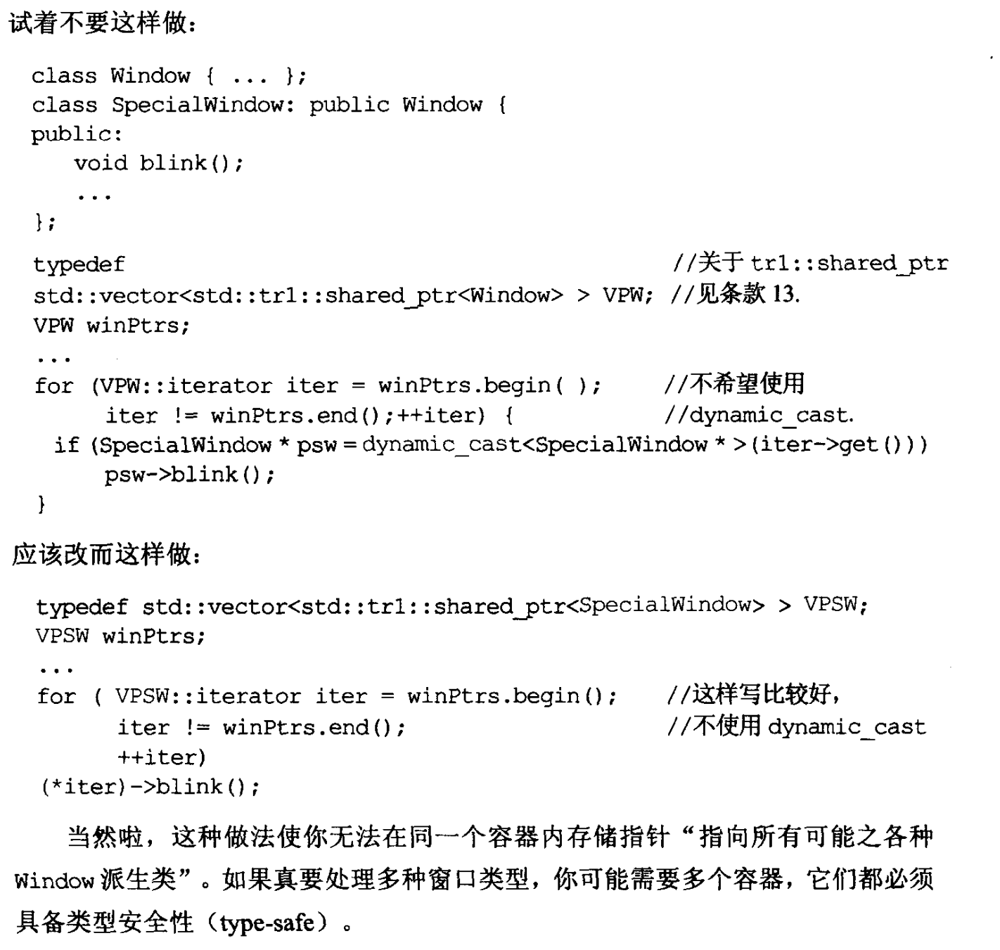

## 介绍自己性能优化的一些经验

1. 首先使用`perf`工具去查询一下整个程序在运行时候的调用堆栈, 得到**火焰图**;
2. 分析火焰图, 找出制约代码运行效率的**短板**(木桶效应), 针对性的优化。
3. 充分利用多核处理器的优势， 使用`线程`或`异步编程`可以使程序相应更加迅速；
4. `内存管理`, 可以使用tcmalloc之类的分配器去减少动态内存分配的次数, 尽量使用栈上分配内存;
5. `编译器的优化`, 编译器的优化参数很大程度上影响release版本的性能。
6. 算法和数据结构的优化；
7. 多线程中锁策略的优化；
8. `关键代码汇编级优化`, `提高缓存击中`。

## 介绍内存问题调查一些经验

1. 遵循**RAII**原则，充分利用C++独特的destructor；
2. 尽可能多的使用智能指针，少使用裸指针；
3. 使用**asan**， **valgrind**等工具，检测undefined behavior, leak, address, thread等问题。

## final
声明类不可被继承

## const
修饰对象使其仅可读  
1. top-level const: 指针自身不可变
> const int* p
2. low-level const: 指针所指不可变
> int* const p
3. 修饰类的成员函数, 标明此函数不可修改非`mutable`对象

## mutex
1. 互斥量, 用于多线程顺序访问共享变量, 得锁者可访问变量
2. lock_guard
3. unique_lock

## dynamic_cast
1. 消耗运行期时间, 会从父类遍历整个对象树, 直到找到符合预期或遍历完对象树为止。
2. 避免写出如下代码：


## virtual dtor
1. 必须设置虚拟析构, 否则使用父类指针存储子类对象, 析构时只能调用父类析构函数, 从而资源泄露;
2. 即使没有设置虚拟析构, 编译器也发现不了;

## 智能指针
1. unique_ptr: 独享资源, 不可复制, 只可转移;
2. shared_ptr: 引用计数, 可复制;
3. weak_ptr: 解决循环引用导致的无法析构的问题; for example:
```c++
#include <iostream>
#include <memory>

class B;

class A
{
    public:
    std::shared_ptr<B> _ptr;

    public:
    A()
    {
        std::cout << "A ctor." << std::endl;
    }
    ~A()
    {
        std::cout << "A dtor." << std::endl;
    }
}

class B
{
    public:
    std::shared_ptr<B> _ptr;

    public:
    B()
    {
        std::cout << "B ctor." << std::endl;
    }
    ~B()
    {
        std::cout << "B dtor." << std::endl;
    }
}

int main()
{
    {
        A a();
        B b();
        a._ptr = b;
        b._ptr = a;
    }
    std::cout << "cannot be destrcted." << std::endl;
}
```